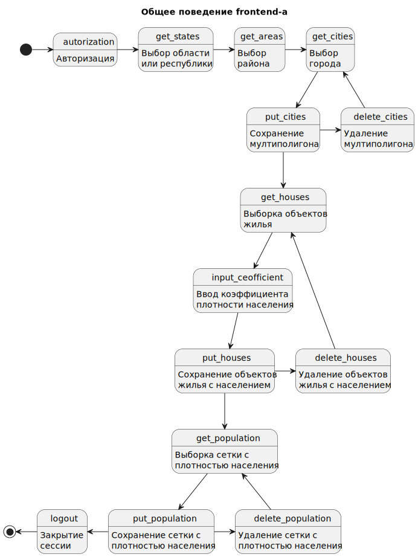
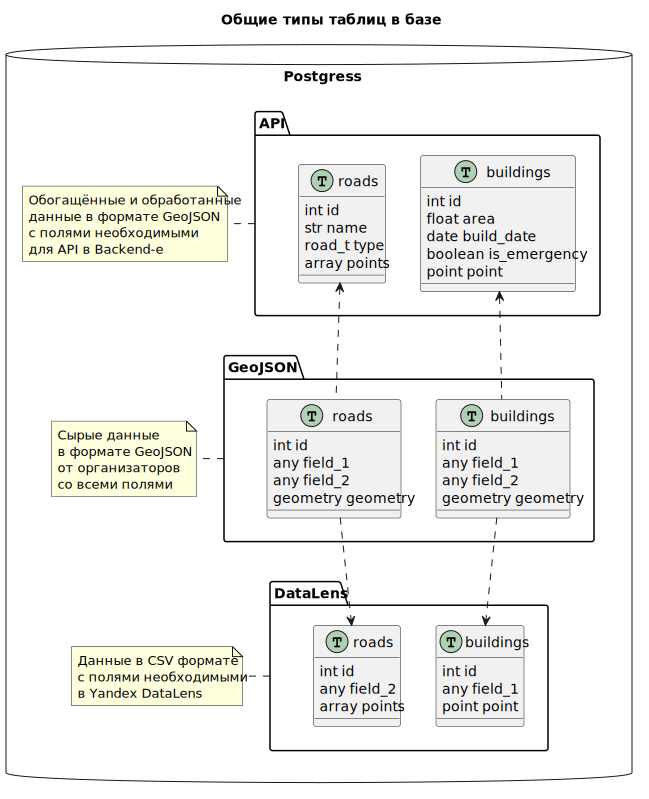
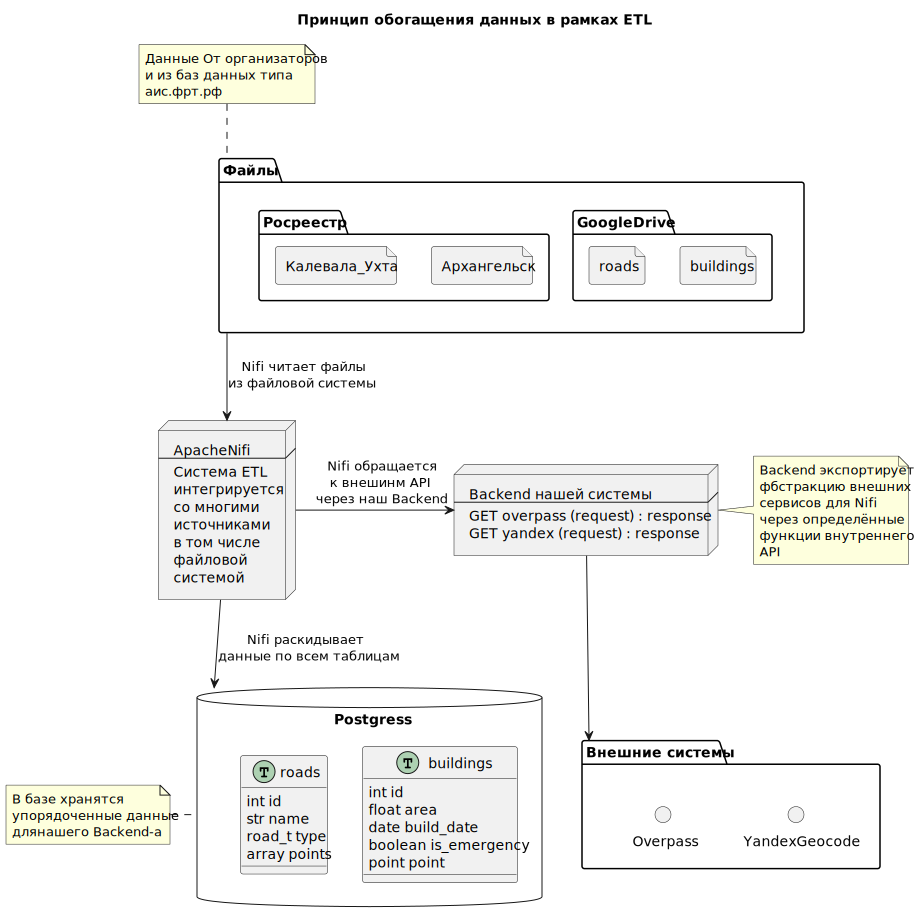

## Архитектура системы

> NorthGate Vologda

Общая архитектура нашего `MVP` в рамках конкурса `ArctechData`.

## Содержание

- [Архитектура системы](#архитектура-системы)
- [Содержание](#содержание)
- [Введение](#введение)
- [Backend](#backend)
- [Frontend](#frontend)
- [База данных](#база-данных)
- [ETL](#etl)
- [DataLens](#datalens)

## Введение

Предполагаемая архитектра.

Обратите внимание на следующие моменты.

Красная стрелочка от `Django` в сторону `Модели` говорит
о том, что мы интегрируем `модель` внутрь кода `Backend`-а. Рождается же
`модель` в недрах сервисов `Yandex`-а: `DataSphere` и `DataLens`.

Пунктирная стрелочка от `ETL` к *внешним сервисам* означает, что `ETL` не
обращается к ним напрямую, хотя является первичным потребителем их данных.
Обращение к упомянутым сервисам происходит через уровень абстракции
предоставляемым `Backend`-ом - Фиолетовая стрелочка.

Жирные стрелочки означают процесс разработки.

Синяя стрелочка идёт от конечного пользователя к его интерфейсу.

## Backend

`Backend` системы будет экспортировать аппликативный интерфейс для
`frontend`-а, а так же иных подсистем, в том числе `ETL`.

На даннном этапе мы наметили функции `API` представленные ниже.

Структуры данных используемые в функциях `API`:

* `touple<str> p_auth` ; пользователь и пароль
* `str p_session_id` ; идентификатор сессии
* `map<int, string> p_states` ; список областей и республик
* `int p_state_id` ; идентификатор области или республики
* `map<int, string> p_areas` ; список районов
* `int p_area_id` ; идентификатор района
* `map<int, string> p_cities` ; список населённых пунктов
* `int p_city_id` ; идентификатор населённого пункта
* `geojson p_geo_city` ; мултиполигон населённого пункта
* `int p_geo_city_id` ; идентификатор слоя населённого пункта
* `geojson p_geo_houses` ; набор точек домов
* `int p_geo_houses_id` ; идентификатор слоя жилых построек
* `geojson p_geo_population` ; набор шестиугольников с плотностью населения
* `int p_geo_population_id` ; идентификатор слоя плотности населения

Далее собствено говоря функции `API`:

* `GET login (p_auth) -> p_session_id`
* `GET logout (p_session_id)`
* `GET states -> p_states`
* `GET areas (p_state_id) -> p_areas`
* `GET cities (p_area_id) -> p_cities`
* `GET city_layer (p_city_id) -> p_geo_city`
* `PUT city_layer (p_geo_city) -> p_geo_city_id` ; сохранение слоя
* `DELETE city_layer (p_geo_city_id) -> void` ; удаление слоя
* `GET houses_layer(p_geo_city_id) -> p_geo_houses` ; в рамках населённого п.
* `PUT houses_layer (p_geo_houses) -> p_geo_houses_id`
* `DELETE houses_layer (p_geo_houses_id) -> void`
* `GET population_layer (p_geo_houses_id) -> p_geo_population`
* `PUT population_layer (p_geo_population) -> p_geo_population_id`
* `DELETE population_layer (p_geo_population_id) -> void`

> TODO: актуализировать `API` по финальному варианту нынешней реализации

Далее будет набор подобных функций для парков, а главное функция расчёта
местоположения объектов инфраструктуры на карте.

Небольшие пояснения.

После прохождения авторизации пользовательский интерфейс получает
идентификатор сессии в виде достаточно длинной строки. Идентификатор
сохраняется на стороне клиента и каждый раз передаётся в заголовках каждой
функции. Я уверена что в `Django` уже реализовано много вспомогательного кода
в плане авторизации и сессии. Надо как можно больше использовать существующие
функции и инструменты.

Каждый новый слой можно будет получить лишь после сохранения предыдущего, так
как для получения нового слоя необходим идентификатор предыдущего. В том, что
мы гоняем данные туда сюда между `GET` и `PUT` есть скрытый смысл - мы
обогащаем данные на `frontend`-е. Так к примеру мы получаем
`набор_точек_домов` в `GET houses_layer` но затем отправляем
`набор_точек_домов_`**с_населением** в `PUT houses_layer`, так как на
`frontend`-е мы прописываем коэффициент соотношения общей площади дома или
больницы и его/её населения или пропускной способности.

`API` должен быть реализован по принципу `RISC` а не `CISC`. `RISC`
подразумевает наличие небольшого набора функций решающих определённую узкую
задачу, так образом, что из этого набора можно построить широкий спектр
приложений. `CISC` же подразумевает большое количество функций решающих
масштабные задачи. Но в нашем случае следуя принципу `CISC` мы получим лишь
одну функцию, так как речь идёт об одной конкретной задаче, а следуя принципу
`RISC` у нас будет большой набор простых функций. Это обеспечит
интегрирующимся системам большую свободу в рамках своих реализаций.

## Frontend

Пользовательская часть будет построена по принципу любой геоинформационной
системы и включать в себя возможность работы с геоинформационными слоями
данных. Интрефейс пользователя будет включать в себя авторизацию и личные
данные пользователей. У пользователей будет возможность сохранить свою
работу в таблице организованной по принципу стека и хранящую созданные
пользователем слои.

В общем предлагается такая диаграмма состояний рабочего пространства:

> TODO: актуализировать описание поведения `frontend`-а по финальному
> варианту нынешней реализации

В общем виде работа пользователя происходит по следующему принципу:

1. Система авторизации
2. Выпадающий список областей
3. При выборе области **появляется** новый выпадающий список районов
4. При выборе района **появляется** новый выпадающий список населённых пунктов
5. При выборе населённого пункта появляется мультиполигон данного пункта
   вмещающийся в экран
6. При каждом новом выпадающем списке, каждый список имеет пустое значение,
   которое является выбранным
7. При изменении нп, собственно говоря экран обновляется с новым нп
8. При изменении района, карта не меняется, но список с нп обновляется с
   выбранным пустым значением
9.  При выборе значения нп появляется мультиполигон данного пункта вмещающийся
    в экран
10. При изменении области исчезает выпадающий список нп, список районов
    обновляется, карта не изменяется
11. При выборе района появляется список с нп, карта всё ещё не меняется
12. При выборе значения нп появляется мультиполигон данного пункта вмещающийся
    в экран

## База данных

В базе будут несколько видов таблиц.

1. Таблицы с основными аппликативными данными используемые `backend`-ом
2. Таблицы с сырыми данными от организаторов
3. Таблицы с данными в `CSV` формате для `Yandex DataLens`

## ETL

В начале у коллег возникло желание объединить алгоритмы обработки данных и
конвертации данных а главное включить сюда процесс подхвата файла с данными
из файловой системы. Но было решено, что это два разных процесса, и загрузка
и конвертация относятся к теме `ETL`.

Как мы видим таблицы с подготовленными данными в системе не могут быть
предоставлены в том же виде, в каком данные хранятся в файлах. Между
подготовленными данными и первичными файлами полученными от организаторов нет
единообразного отображения друг в друга. В исходных файлах есть много лишней
информации, много лишних и дублирующихся столбцов, а порой нужная информация
раскидана по нескольким файлам. Так же у многих данных в исходных файлах есть
одна и та же структура и онтологический смысл, и по сути их данные можно
объеденить.

Все вопросы подготовки данных к использованию посредством `API` решаются
системой `ETL`: `Extract` -> `Transform` -> `Load`. В нашем случае мы выбрали
`Nifi`в качестве инструмента решающего данную задачу.

Вот общая схема `ETL`:

## DataLens

При проработке задачи на экспорт данных из `API` в `DL` выяснилось, что
`Yandex` не умеет обращаться на свободный `API` за данными, то есть ограничен
в наборе разных вариантах источников данных. Мы решили этот момент созданием
специальных буферов данных в рамках БД с форматом доступным сервису
`DataLens`. Данные будут поступать в буфер в рамках натроенных процессах в
системе. При этом, так же важно заметить, что `DataLens` к сожалению не
имеет возможности постоянной синхронизации с данными. Так что будет
необходимость каждый раз пересоздавать весь стек кроме соединения:
источник данных, диаграмму (`chart`), панель (`dashboard`).

Тогда возникает первый вопрос: почему бы в общем не выгрузить все данные из
`geojson` в `csv` и просто напрямую не дать `DL` доступ к таблицам?
И сразу второй вопрос: Зачем в принципе таблицы с данными в `GeoJSON` формате?

Ответ на второй вопрос: `DL` пока используется как прототип, далее наша система
уже будет продовой и она то как раз по своей питоновской сути более чем сможет
работать с `PostGIS`-ом, по сему необходимо оставить данные в геоформате.

И ответ на первый вопрос: в `DL` нет возможности (как я поняла, может ошибаюсь)
параметризировать выборку в стиле окружностей и тд, по сему нужно дать
возможность пользователю сделать некую операцию над данными и предоставить их
в `DL` уже подготовленными. А вот подготовка то как раз будет происходить с
данными в `GeoJSON` на уровне нашей системы.
