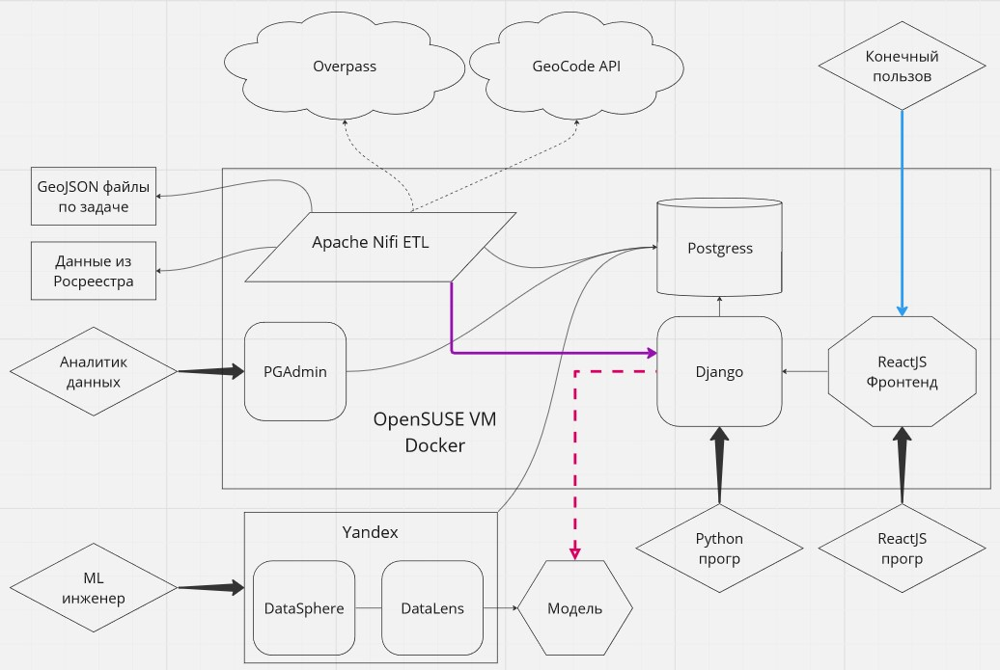

## Архитектура системы

Пока кидаю данные неорганизовано, затем надо будет всё оганизовать.

При проработке задачи на экспорт данных из API в DL выяснилось, что Yandex не
умеет обращаться на свободный API за данными, то есть ограничен в наборе
разных вариантах источников данных.
Мы решили изменить подпись функции с YandexData getTouristObjects(Touple
center, real redius) на void getTouristObjects(Touple center, real redius)
где функция по сути не вернёт структуру а положит её в буфер всё того же
Postgres-а.

Тогда возникает первый вопрос, почему бы в общем не выгрузить все данные из
geojson в csv и просто напрямую не дать DL доступ к таблицам?

И сразу второй вопрос: Зачем в принципе таблицы с данными в GEO формате?

Ответ на второй вопрос: DL пока используется как прототип, далее наша система
уже будет продовой и она то как раз по своей питоновской сути более чем сможет
работать с PostGIS-ом, по сему необходимо оставить данные в геоформате.

И ответ на первый вопрос: в DL нет возможности (как я поняла, может ошибаюсь)
параметризировать выборку в стиле окружностей и тд, по сему нужно дать
возможность пользователю сделать некую операцию над данными и предоставить их
в DL уже подготовленными. Частично этим занимается DataSphere, но до него я
ещё не добралась, хотя уже пора бы.

Далее у коллег возникло желание объединить алгоритмы выборки окружности и
конвертации данных а главное включить сюда процесс подхвата файла с данными
из файловой системы. Мы с Тёмой решии что это два разных процесса, и загрузка
и конвертация относятся к теме ETL, которую надо проработать отдельно.
Поставлю задачу на проработку. А работа с данными к логике.

При этом таблицы с данными в системе в общем не представлены таким же образом
как файлы, у них нет единообразного отображения друг в друга, так как у очень
многих данных есть одна и та же структура и онтологический смысл, и по сути
их можно хранить вместе. Так же есть много лишних и дублирующихся столбцов.
То есть так или иначе есть процесс ETL и подготовки данных. Пока он может
проходить в ручную, пока его можно не автоматизировать. Далее, его можно или
написать на Питоне или подумать в сторону Nifi, который очень красиво во всё
это ложится.

Следующая картина включает небольшой Web интерфейс на RectJS где пользователь
выбирает радиус окружностии и центр, пусть пока это будет единственная не
включая авторизацию (а это святое) функция.

Пока сложилась такая картина:
1. У системы есть пул данных, который уже готов к работе над собой
2. Так же у системы есть буфер для данных на экспорт в DL
3. В DL настроен DataSource на целевые таблицы в Postgres
4. Есть небольшой Web интерфейс на RectJS
5. Пользователь выбирает радиус окружностии и центр
6. Запрос идёт на API REST функцию на Django
7. API переносит необходимые данные в буфер
8. Конечный пользователь обновляет DataSource и получает нужную картину
9. Далее продолжает необходимую работу в связке DataLens - DataPshere

Сейчас это ещё нарисую в Miro, в будущем диаграммы наверное надо будет
переносить в репозиторий на PlantUML.

Предполагаемая архитектра.

