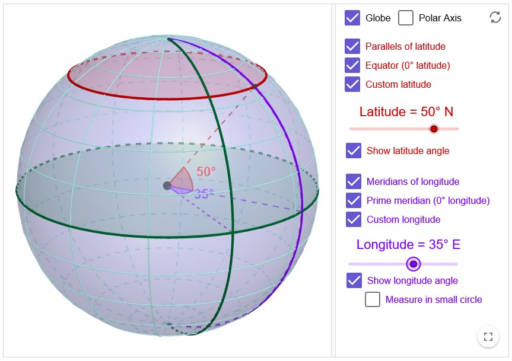
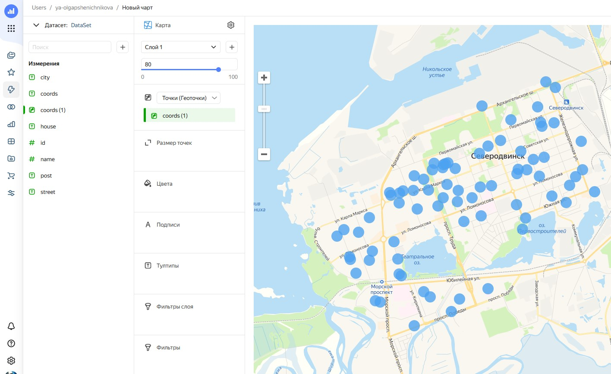

## Система координат

- [Система координат](#система-координат)
- [Термины](#термины)
- [WGS 84](#wgs-84)
- [Pseudo Mercator](#pseudo-mercator)
- [Наш случай](#наш-случай)

## Термины

* `longtitude` - долгота, отклонение от нулевого меридиана
* `latitude` - широта, отклонение от экватора
* `SRS` - spatial reference system
* `CRS` - coordinate reference system
* `EPSG` - European Petroleum Survey Group

*Spatial* - пространственный.
*Survey* - исследование

> Дабы запомнить, что `longtitude` это долгота, запомните, что *long* это
> *долго*

Система координат в геодезии, это математическая модель отображения каждой
точки на земле в определённую точку на выбранном геометрическом объекте.
При отображении точек на выбранный идеальный геометрический объект, без
погрешностей обойтись невозможно. Так, например размер РФ на карте Меркатора
заметно превышает её истинные размеры. Это происходит в связи с тем, что Земля
не является НИ КАКИМ идеальным объектом, ни элипсоидом ни шаром. Одна из самых
близких к реальности систем координат, это [`WGS 84`][1]. Она отображает точки
с поверхности земли на гипотетический эллипсоид. Далее мы подробнее разберём
эту систему координат. Вторая система с которй мы сталкнёмся, это
[`EPSG::3857`][2] - `Pseudo Mercator`. Почему *псевдо*, мы тоже узнаем ниже.
Она отображает точки шара на цилиндр середина высоты которого совпадает с
плоскостью экватора, затем этот цилиндр разворачивается подобно свитку на
столе.

Система координат может быть [геоцентрическая и геодезическая][5].
Первая используется для работы с орбитами спутников, вторая для работы
над картами Земли. То есть далее мы говорим о гедезической системе
координат.

## WGS 84



Гедезическая система координат, каждая точка которой представлена двумя
параметрами: долгота и широта. Обе измеряются в градусах отклонения от
начала угла. Для долготы это нулевой меридиан проходящий через окресности
Лондона, где стояла обсерватория исследователи которой учавствовали в
разрабтке этой системы, а для широты, это экватор. Для обоих отклонений
необходимо указать модификатор стороны света: север, юг, запад, восток,
фатически градус не может быть отрицательным. Для долготы максимальный градус,
это 180, так как точка по долготе проходит всё полушарие. А вот для широты,
макисмальный градус, это 90, так как при отклонении от экватора происходит не
смещение точки, а смешение всей окружности параллельной эвкатору и проходящей
через эту точку. Смотрите рисунок.

[Тут][3] вы сможете поиграться с этой системой координат.

## Pseudo Mercator

Так же назван `Web Mercator projection`.

Из [вот этого][4] источника я нашла прекрасное объяснение почему `EPSG::3857`
называют `Pseudo Mercator`

> Равноугольная проекция Меркатора может быть как на сфере, так и на
> эллипсоиде. А проекция Web Mercator потому и не является настоящей
> проекцией Меркатора, что использует формулы вычислений для сферы, но
> применяет их к широте и долготе на эллипсоиде WGS84, а не на сфере. То есть
> по формулам проекции вы непосредственно конвертируете EPSG:4326 в EPSG:3857
> и обратно. Дополнительных преобразований не нужно.

В данной проекции используется декартова система координат, проецирующая
геодезические координаты `WGS 84` используя формулы приведёные ниже. Обычно,
если не сказано иначе, координаты записаны в порядке: `lon`, `lat`.
Значение $(0, 0)$ следуя написаному в `Wikipedia`-и соответствует левому
верхнему углу проекции, а нижний зависит от коэффициента приближения
$zoom\ level$ и представлен выражением
$(2^{zoom\ level}-1, 2^{zoom\ level}-1)$ Параметры передающиеся формулам
исчисляются в радианах, результат представлен пикселями. Напомню, что $\pi$
радиан, это $180\degree$. Возникает вопрос: как перевести значение `WGS 84` в
котором присутствует показатель стороны света, например
*65 градусов северное широты, 45 градусов восточной долготы* в чистый угол?
Скорее всего отсчёт идёт от пересечения экватора и нулевого меридиана в сторону
севера и востока, далее по кругу. Интересно, что точной информации по этому
моменту я ни где не нашла.

$$
x = [\frac{1}{2\pi} \cdot 2^{zoom\ level}(\lambda-\pi)]\ pixels
$$

$$
y = [\frac{1}{2\pi} \cdot 2^{zoom\ level}
(\pi - ln[tan(\frac{\pi}{4}-\frac{\phi}{2})])]\ pixels
$$

Где $zoom\ level$ это значение приближения от нуля до единицы, где ноль это
максимальное отдаление. $\lambda$ - долгота в радианах. $\phi$ широта в
радианах.

Как мы помним из определения тригонометрических функций в единичном круге,
тангенс угла, это отношение противолежащего катета к прилежащему. Если в
единичном круге, угол поворота гипотинузы равен $90\degree$, то длинна
прилежащего катета схлопывается в ноль. Отношение стремиться к бесконечности.
Далее и логорифм от бесконечности равняется бесконечности. В том числе, если
тангенс угла равняется нулю, то логорифм от нуля стримиться к минус
бесконечности, так как только с минус бесконечной степени, основание логорифма,
а в нашем случае это $e$ превратиться в ноль. С такими случаями наше уравнение
сталкивается в полярных значениях широты: $90\degree$, $270\degree$,
$450\degree$ и так далее. Каждый раз меняется знак бесконечности с плюса на
минус. В свзяи с этим, карты Меркатора обрезаны по заданной
широте и исключают полюсы. Максимальным значением $\phi$ является следующее.

$$
\phi_{max} = [2\arctan(e^{\pi})-\frac{\pi}{2}]
$$

## Наш случай

Все наши наборы данных представлены в `CRS`: `EPSG::3857`. Мы можем узнать это
из заголовка `geojson`-а:

```json
{
    "type": "FeatureCollection",
    "name": "auto_foot_graph_arh_obl",
    "crs": {
        "type": "name",
        "properties": {
            "name": "urn:ogc:def:crs:EPSG::3857"
        }
    }
}
```

Имея каждую такую координату, мы можем перевести её в `WGS 84` используя
уже известный всем [сервис][6] перерасчёта координат. Нужно выбрать: из
`EPSG::3857` в `WGS 84`. Далее получившиеся координаты **В ОБРАТНОМ** порядке
вставить в Яндекс карты.

Для того, чтобы загрузить данные в `Yandex DataLense` необходимо добавить
транспортировку данных в целевой `CRS` в `Notebook`-е
[выгрузки](../Notebooks/GeoJSON/).

Для того, что бы загрузить данный в `Yandex Datalense`, откройте
[`Wizard`][7]. Слева панель уинструментов. Подключения ->
создать подключение -> файлы -> загрузить файлы -> выбирите файл ->
создать подключение -> выбирите имя -> сохранить.
Далее там же на панеле инструментов. Датасеты -> создать датасет ->
подключения -> выбирите подключение -> сохранить -> задайте имя ->
создать. Далее там же на панеле задачь. Чарты -> чарт ->
тип карта, там где столбчатая диаграмма -> выбирите датасет ->
выбирите свой датасет -> нажмите на иконку колонки с координатами ->
задайте тип. Данные самине должны включать имена функций типа `GEOPOINT`,
а лишь сами данные правильно труктурированные. Перетащите колонку с
координатами в соответсвующее поле координат колонки конфигурации карты.



[1]: https://ru.wikipedia.org/wiki/WGS_84
[2]: https://en.wikipedia.org/wiki/Web_Mercator_projection
[3]: https://www.geogebra.org/m/YVyn39ff
[4]: https://gis-lab.info/forum/viewtopic.php?t=22965
[5]: https://gis-lab.info/qa/geodesic-coords.html
[6]: https://mapbasic.ru/msk-wgs
[7]: https://datalens.yandex.ru/wizard/

