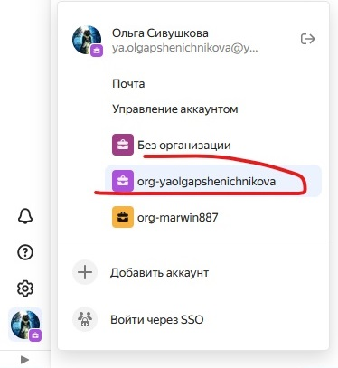
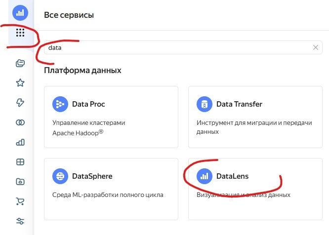
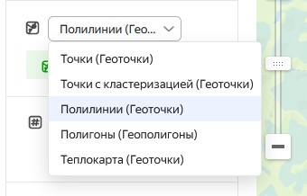
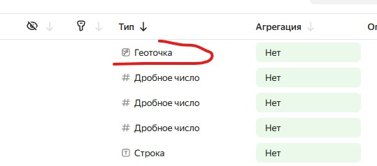
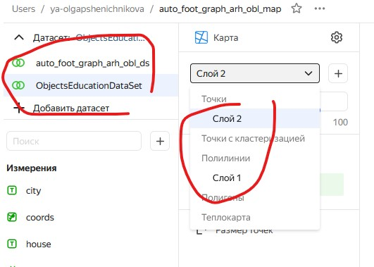
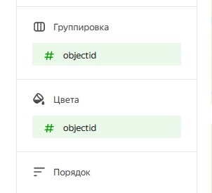
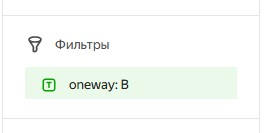

## Yandex DataLense

Yandex DataLense это сервис который мы используем для исследования
геолокационных данных. В нашей группе мы используем централизованную
схему в облачном пространстве Яндекса, далее *Облако*.

## Оглавление

- [Yandex DataLense](#yandex-datalense)
- [Оглавление](#оглавление)
- [Доступ](#доступ)
- [Подключение](#подключение)
- [Концепция](#концепция)
- [Практика](#практика)

## Доступ

Для получения доступа пройдите [процесс социализации](README.md) в нашей
корпорации.

## Подключение

Для подключения к *Линзе* выполните следующую последовательность действий.

## Концепция

В плане геоданных в *Линзе* есть несколько типов геолокационных данных.
Пока нас интересуют три основных:

* Точки (Геоточки)
* Полилинии (Геоточки)
* Полигоны (Геополигоны)

Формат точек с точки зрения `CSV` это массив с двумя координатами.

Формат полилинии это массив с двумя координатами в каждой записи, но так
что между записями есть дополнительная колонка, которая их объединяет.
По принципу группировки можно так же задать и цвет, смотрите ниже.
Формат полигонов это массив с тремя уровнями вложения:
`[ [ [x, y], [x, y], [x, y] ... ] ]`.

## Практика

Создайте подключение из файла или базы данных, затем создайте `Data Set`
основываясь на подключении и задайте нужный формат колонкам геоданных.

Вы можете уже на этапе набора данных установить фильтрацию значений.

Создайте график и добавьте необходимые наборы данных, создавая необходимое
количество слоёв для дальнейших применений функций над данными.

При работе с полилиниям, настройте группировку и колонку сегрегирующую
цвета для каждой линии.

Если данных очень много, вы можете добавить фильтр.

