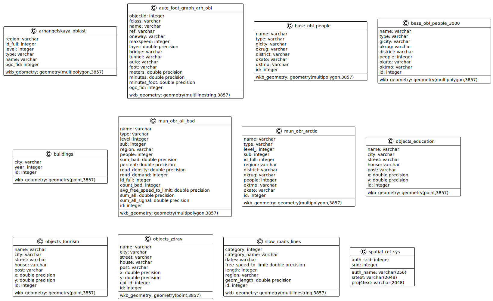

## Документация по базе данных корпорации *NorthGate*

Здесь содержится полное описание структуры базы данных *Postgres*

## Генерация UML - диаграммы в Visual Studio Code

UML в Visual Studio Code создается с помощью плагина `PlantUML`, после этого нужно создать файл с расширением `.wsd`, в ней можно писать UML код, для генерации `SVG` необходимо в `UML файле`  нажать правой кнопкой мыши и выбрать `Export Current Diagram`

Для унификации конфигурация пути для сохранения `svg` прописана в файле `.code-workspace`.

## UML - диаграмма базы данных

