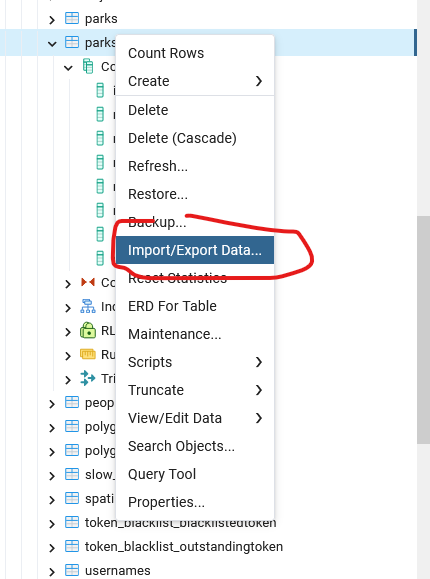
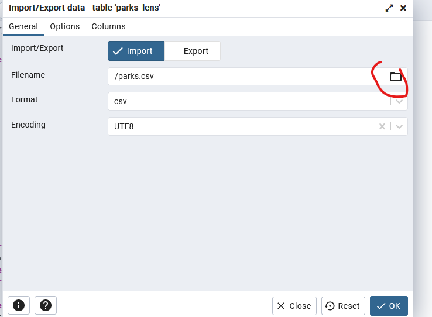
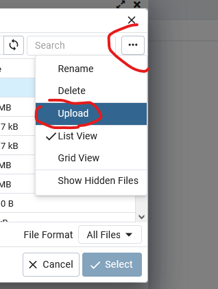
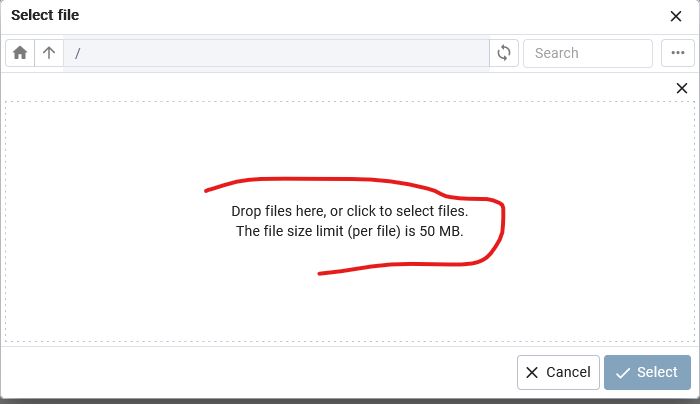
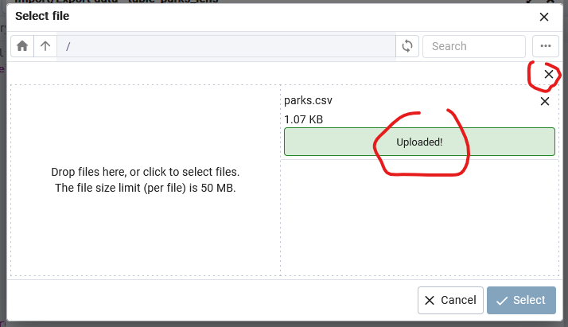
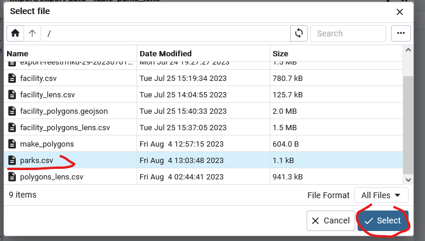
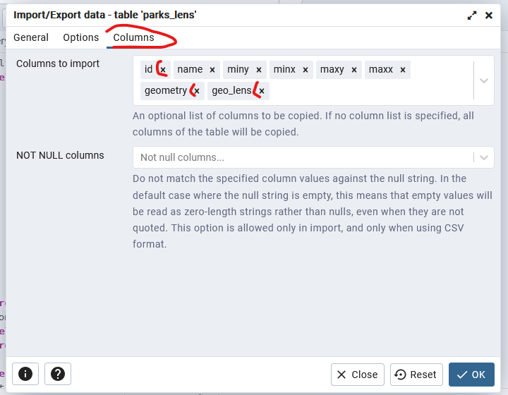

## База данных

Общая информация о взаимодействии с базой данных.

## Содержание

- [База данных](#база-данных)
- [Содержание](#содержание)
- [Загрузка geojson](#загрузка-geojson)
- [Полезные команды](#полезные-команды)
- [Загрузка CSV](#загрузка-csv)

## Загрузка geojson

Для загрузки `GeoJSON` файла в базу данных выполните следующие шаги:

1. Загрузить файл на хост
2. Загрузить файл в `Docker` контейнер
3. Подключится к контейнеру
4. Загрузить файл с командой `ogr2ogr`
   1. Команда загрузит данные в схему `public`
5. Перенести данные в схему `northgate`
   1. Целевая таблица должна быть создана заранее

Используйте примонтированную с хоста папку или команду `docker cp` для
загрузка данных в контейнер.

Для подключения к `Docker` контейнеру базы выполните:

```sh
sudo docker exec -it <id> bash
```

> TODO: Создать скрипты в `Swarm`-е для автоматического подключения

Далее команда непосредственно для загрузки файла:

```sh
ogr2ogr -progress \
  -f "PostgreSQL" \
  PG:"user=<user> dbname=northgate password=<password>" \
  path-to-file.geojson`
```

Где:
- `<password>` - ваш пароль
- `<user>` - ваш логин
- `path-to-file` - путь к `GeoJSON` файлу

Для переноса данных между таблицами воспользуйтесь командой на подобии:

```sql
INSERT INTO northgate.facility_polygons (
	id,
	facility_id,
	geometry,
	type2)
SELECT ogc_fid, facility_id, wkb_geometry, type2
FROM public.facility_polygons
```

## Полезные команды

Подключение из терминала с суперпользователем:

```sh
NIFI_CONT=$(sudo docker ps --filter "name=db_postgres" -q)
sudo docker exec -it $NIFI_CONT /bin/bash
su - postgres
psql -d northgate
```

Закрытие сессий:

```sql
SELECT pg_terminate_backend(pid)
FROM pg_stat_activity
WHERE pid <> pg_backend_pid()
AND datname = 'northgate';
```

## Загрузка CSV

Загрузку данных в формате `CSV` можно выполнить следющим образом.

Выбираем таблицу, правой клавишей: `Import/Export`:



Переходим в хранилище файлов, старые файлы можно удалить:



Загружаем файл:



Перетаскиваем файл:



Выходим из окна:



Выбираем загруженный файл:



Удаляем лишние колонки, которых нет в `CSV`-шке:



Перед импортом таблицу надо очистить командой `TRUNCATE`.
