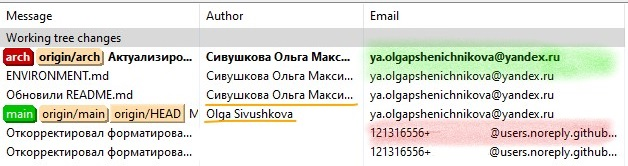

## NorthGate

Добро пожаловать в корпорацию *NorthGate*.

## Оглавление

- [NorthGate](#northgate)
- [Оглавление](#оглавление)
- [Термины](#термины)
- [Социализация](#социализация)
- [Git](#git)
  - [Pull requests](#pull-requests)
- [Генерация UML](#генерация-uml)

## Термины

* *Группа* - координационная группа в `Telegramm`-е
* *Хранилище* - файловое хранилище на `Google Drive`-е
* *Ресурсы* - файл централизующий наши ресурсы
* *Проект* - Проект на `GitHab`-е
* *Облако* - облачные сервисы `Яндекса`
* *Datalens* - сервис `Yandex Datalens`
* *DataSphere* - сервис `Yandex DataSphere`

## Социализация

1. Вступите в нашу *Группу*
2. Попросите доступ к *Хранилищу*
3. Зарегестрируйтесь в *Ресурсах* на вкладке `HR`
4. Попросите подключить вас к *Проекту*
5. Попросите подключить вас к *Облаку*
6. Попросите выдать вам права на *Datalens*
7. Попросите выдать вам права на *DataSphere*

## Git

Для работы с гитом вам необходимо зарегистрироваться в `GitHub`-е. Локально
вы можете использовать любой клиент. Перед первым коммитом **ОБЯЗАТЕЛЬНО**
настройте свои данные. Если вы используете клиент `GitHub`-а и не настроите
свои данные то ваша почта в истории коммитов будет отображаться скорее всего
не та которую бы вы хотели. Важно сказать, что для `Git`-а как экосистемы
самое важное это электронный адресс того, кто делает коммит. Любая система
основанная на `Git`-е будет идентифицировать вас именно по `eMail`-у даже
если в разных коммитах вы указали имя по разному.

Обратите внимание на картинку ниже. Там вы видете зелёным отмечена хорошая
настройка почты. Красным настройка почты по умолчанию. Имя пользователя я
заштриховала. Так же оранжевым подчёркнуты разные варианты указания имени,
при этом система опознает эти коммиты совершённые одним и тем же человеком.



При настройке почты **ОБЯЗАТЕЛЬНО** укажите именно ту почту, что настроена у
вас в `GitHub`-е. Так комманда сможет мониторить ваш вкладд в проект через
коммиты.

Для настройки пользовательских данных, вы можете использовать интерфейс
конкретной системы, которую используете. В крайнем случае это можно сделать
[напрямую][1] через коммандную строку. Если на одном компьютере вам
необходимо авторизоваться в разных репозиториях, используйте флаг `--local`,
если такой необходимости нет, то `--global`.

```sh
git config --local user.name "Сивушкова Ольга Максимовна"
git config --local user.email "ya.olgapshenichnikova@yandex.ru"
```

### Pull requests

В идеале все основные ветки в проектах должны быть защищены, соответственно
туда нельзя просто запушить коммит. Следовательно слияние в основную ветку
должно идти через `Pull Request`.

1. Создаём у себя локальнов ветку отделяющуюся от основной
2. Заливаем её в репозиторий
3. В интерфейсе `GitHub`-а делаем запрос на слияние - `PR`
4. Ответственные люди проведут `Code Review` и напишут коментарии
5. Автор ветки решит все запросы проверяющих
6. Ответственные люди сольют изменения

## Генерация UML

Диаграммы в Visual Studio Code.

UML в Visual Studio Code создается с помощью плагина `PlantUML`, после этого
нужно создать файл с расширением `.wsd`, в ней можно писать UML код, для
генерации `SVG` необходимо в `UML файле`  нажать правой кнопкой мыши и
выбрать `Export Current Diagram`

Для унификации конфигурация пути для сохранения `svg` прописана в файле
`.code-workspace`.

[1]: https://git-scm.com/book/ru/v2/Введение-Первоначальная-настройка-Git

### Загрузка GeoJSON файла в базу данных

Для загрузки GeoJSON файла в базу данных выполните следующие шаги:

1. Зайдите в процесс Docker-контейнера базы данных:  
   `sudo docker exec -it <id> bash`

2. Введите следующую команду:  
   `ogr2ogr -progress -f "PostgreSQL" PG:"user=<user> dbname=northgate password=<password>" path-to-file.geojson`

   Где:
   - `<password>` - ваш пароль
   - `<user>` - ваш логин
   - `path-to-file` - путь к GeoJSON файлу
